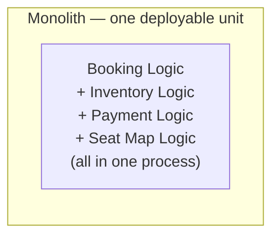
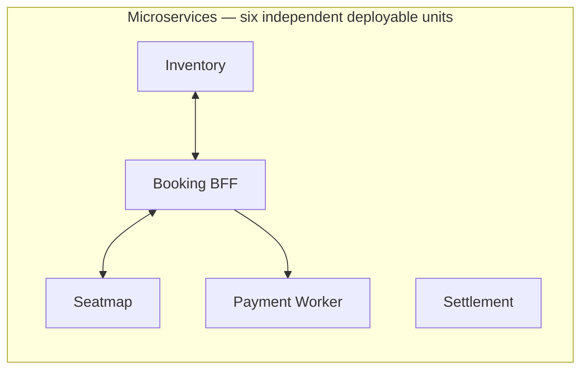
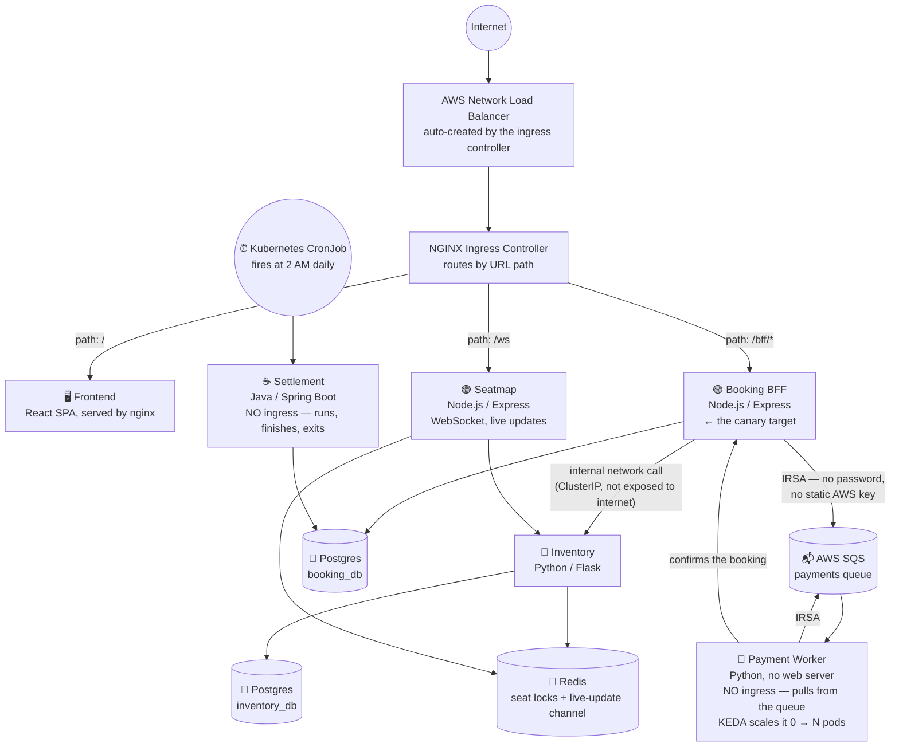
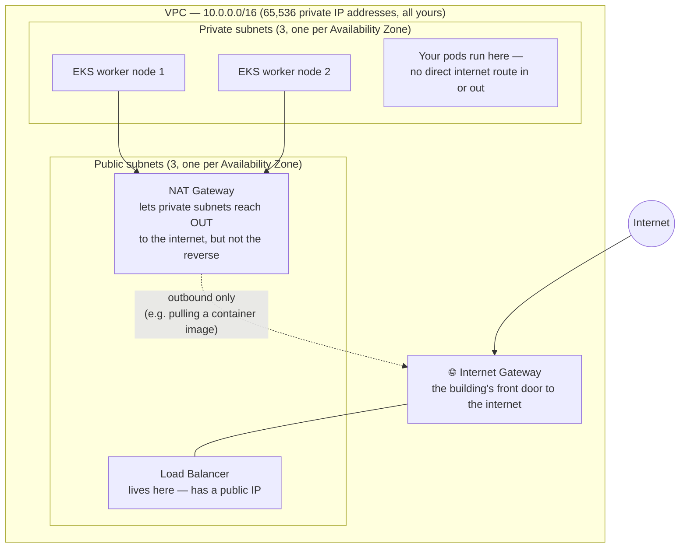
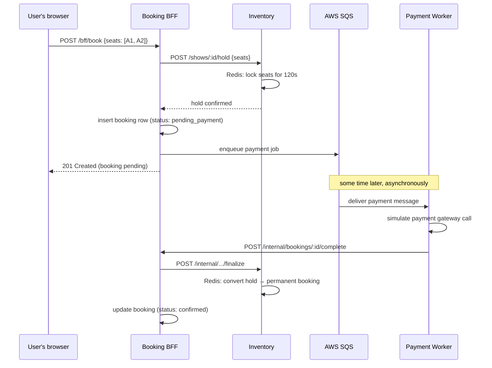
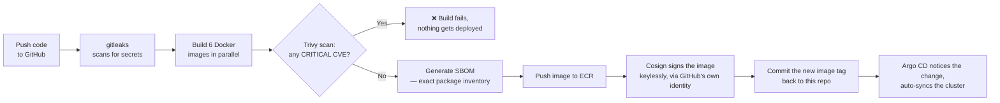

# Seat Booking Platform

A cloud-native, production-style movie/event seat booking system, built to
demonstrate real DevOps and platform engineering practices — not just "deploy
an app to Kubernetes," but the full lifecycle: infrastructure as code,
container security scanning, GitOps deployment, progressive delivery with
automatic rollback, autoscaling, and observability.

Six services, three programming languages, one AWS EKS cluster, one CI/CD
pipeline that builds, scans, signs, and deploys every one of them the same way.

**Demo video:** _(link here once recorded)_

---

## Table of contents

1. [What this project actually is](#1-what-this-project-actually-is)
2. [Why microservices — explained simply](#2-why-microservices--explained-simply)
3. [The application architecture](#3-the-application-architecture)
4. [The AWS networking layer, explained](#4-the-aws-networking-layer-explained)
5. [Every microservice, one at a time](#5-every-microservice-one-at-a-time)
6. [How a booking actually flows through the system](#6-how-a-booking-actually-flows-through-the-system)
7. [The platform layer (what runs *around* the app)](#7-the-platform-layer-what-runs-around-the-app)
8. [The CI/CD pipeline, step by step](#8-the-cicd-pipeline-step-by-step)
9. [The 5 demos this project proves](#9-the-5-demos-this-project-proves)
10. [Running it yourself](#10-running-it-yourself)
11. [Design decisions and trade-offs](#11-design-decisions-and-trade-offs)
12. [What's deliberately left out](#12-whats-deliberately-left-out)
13. [Every real bug hit while building this](#13-every-real-bug-hit-while-building-this)
14. [Repo layout](#14-repo-layout)

---

## 1. What this project actually is

Picture a BookMyShow/Fandango-style app: pick a show, pick seats, pay, get a
confirmation. That's the product. The actual point of this project is
everything *around* that product — the platform that builds it, ships it,
runs it, and keeps it running safely.

**The one-sentence claim this project makes:** a synchronous
request/response workload (booking a seat, an HTTP call that needs an
answer right now) and an event-driven asynchronous workload (processing a
payment in the background) both flow through the exact same delivery
pipeline — same CI, same security scanning, same GitOps deployment — with
zero special-casing between them.

---

## 2. Why microservices — explained simply

If you're new to this term: a **monolith** is one program that does
everything — one codebase, one process, one deployment. A **microservice
architecture** splits that program into several small, independent programs
that talk to each other over the network, each one responsible for exactly
one thing.





**Honest answer for "why did you pick microservices for a project this
small":** for a *real* booking business, a **modular monolith** (one
codebase, cleanly organized into internal modules) would actually be the
smarter engineering choice — it's faster to build, cheaper to run, and
simpler to debug, since there's no network between the pieces. This project
deliberately does the more complex thing instead, because the *goal* isn't
"build a booking app" — it's "demonstrate platform engineering," and several
of the things being demonstrated are literally impossible to show with a
single deployable unit:

| Platform feature being demonstrated | Why it needs more than one service |
|---|---|
| Distributed tracing across a network call | There has to *be* a network call to trace |
| Per-service SLOs / error budgets | "This service has a 99.9% target" only means something if services are measured independently |
| NetworkPolicy (network-level access rules) | "Only the booking service may talk to inventory" is meaningless if there's only one process |
| Cascading failure | The project's readiness-probe postmortem — Inventory blips, causes the Booking BFF to wrongly report unhealthy, causes a total outage — structurally requires two separate services, one failing into the other |
| Independent scaling | The Payment Worker scales 0→10 pods based on queue depth; Inventory scales on CPU. That's two different scaling *policies*, only possible with two different deployable units |

In a real production system, the right move is: **start with a monolith,
and only split out a microservice when a genuine team boundary** (a
different team needs to own and ship it independently) **or scaling
boundary** (this one part needs to handle 100x the load of everything else)
**actually forces it.** Splitting into six services on day one, for a brand
new product, is usually a mistake — this project does it deliberately, for
a stated reason, not by default.

---

## 3. The application architecture



**The detail that matters most here:** Payment Worker and Settlement have
**no ingress at all** — nothing on the internet can reach them directly. One
is triggered by a message arriving in a queue, the other by a clock. That's
the concrete proof behind the "one pipeline, two workload shapes" claim —
they're built, scanned, signed, and deployed by the exact same CI pipeline
and the exact same Helm chart as the four services that *do* take HTTP
traffic, with zero special-casing.

---

## 4. The AWS networking layer, explained

This is the part that trips up most people new to cloud infrastructure, so
here it is spelled out plainly. A **VPC** (Virtual Private Cloud) is your
own private, isolated slice of AWS's network — think of it as your own
private building, with rooms (**subnets**) inside it.



**Why split into public and private subnets at all?** Security. Your actual
application code — the pods running Inventory, Booking BFF, etc. — sits in
**private subnets**, which have **no direct route in from the internet at
all**. The only way in is through the Load Balancer sitting in the public
subnet, which forwards traffic to the ingress controller, which then routes
it internally. Even if someone knew a pod's internal IP address, there's no
network path from the public internet to reach it directly.

**Why do private subnets need the NAT Gateway at all, if they can't be
reached from outside?** Because your pods still need to reach *out* —
pulling a container image from ECR, or your payment worker calling AWS SQS.
A NAT Gateway allows outbound-only internet access: traffic can leave, but
nothing new can come back in *starting* from the outside.

**Route tables** are simply the rules that say "traffic to this range of
addresses goes out this door." This project has three:
| Route table | Attached to | Rule |
|---|---|---|
| Public route table | The 3 public subnets | "Anything not on our private network → go out the Internet Gateway" |
| Private route table | The 3 private subnets | "Anything not on our private network → go out the NAT Gateway" |
| Default (unused) | Nothing | Terraform always creates this; harmless |

**Why 3 of each subnet (one per Availability Zone)?** An Availability Zone
is physically a separate data center. Spreading subnets across 3 of them
means if one entire data center has a problem, your app can keep running in
the other two — this is what "highly available" means in AWS terms.

**Cost-saving trade-off made here:** a *real* production setup would run
**one NAT Gateway per Availability Zone** (3 total), so that even a NAT
Gateway failure in one zone doesn't affect the other two. This project uses
**a single, shared NAT Gateway** for all three private subnets instead —
correct for a portfolio project running for a few hours, wrong for a system
that needs to survive a data-center-level failure. That trade-off is made
explicitly and documented, not silently.

**Security Groups** are the actual firewall rules — "this specific set of
machines may only accept traffic on this specific port, from this specific
source." Every layer here (VPC subnets, route tables, security groups) is a
*progressively more specific* rule, stacked on top of each other, all the
way down to (intentionally) individual **Kubernetes NetworkPolicies**
deciding exactly which service may talk to which other service — see §9 for
where that last layer currently has a known gap.

---

## 5. Every microservice, one at a time

### 🐍 Inventory (Python / Flask)
The "source of truth" for what shows exist and which seats are taken. Owns
its own Postgres database (`inventory_db` — just `users` and `shows`
tables) and uses Redis for two things: a **temporary hold** on a seat (a
120-second lock while someone's checking out) and a **permanent record**
once a seat is actually booked.

### 🟢 Booking BFF — "Backend For Frontend" (Node.js / Express)
The only service the frontend actually talks to. Owns its own `bookings`
table in a *separate* Postgres database (`booking_db`) — this is the
microservices data-ownership rule in action: Inventory and Booking BFF each
own their own tables and never reach into each other's database directly,
only through HTTP calls. This is also the **canary deployment target** —
the one service where new versions get rolled out gradually and watched for
errors before going fully live (see §9).

### 🟢 Seatmap (Node.js / Express + WebSocket)
Keeps a live, real-time seat map updated in every connected browser. When
anyone holds or books a seat, this service pushes an update instantly to
everyone else looking at that same show — no page refresh needed.

### 🐍 Payment Worker (Python, no web server)
Doesn't accept any incoming traffic at all. Sits and waits for messages to
appear in an AWS SQS queue, processes each payment (simulated), then tells
Booking BFF the booking is confirmed. Scales itself from **zero pods** (no
compute cost when idle) up to ten, purely based on how many payments are
waiting — this is what "event-driven autoscaling" means in practice.

### ☕ Settlement (Java / Spring Boot)
Runs once a night, reconciles the day's confirmed bookings into a
settlement report, then **exits** — it's not a long-running server at all,
it's a Kubernetes **CronJob**: start, do the work, stop, wait for tomorrow.

### 🖥️ Frontend (React + Vite)
The actual seat-picker UI, served as static files through nginx.

---

## 6. How a booking actually flows through the system



Notice the user gets an immediate response ("booking pending") without
waiting for the payment to actually process — that's the synchronous/async
split this whole project is built to demonstrate.

---

## 7. The platform layer (what runs *around* the app)

None of this is application code — it's the infrastructure that makes the
app deployable, observable, and safe to change.

| Component | Plain-English job |
|---|---|
| **Terraform** | Writes the AWS infrastructure (VPC, EKS, databases-adjacent resources) as code instead of clicking buttons in a console — repeatable, reviewable, destroyable |
| **EKS** | AWS's managed Kubernetes — the container orchestrator that actually runs your services |
| **Argo CD** | Watches this GitHub repo; the moment it sees a change to what *should* be deployed, it makes the cluster match, automatically — this is "GitOps" |
| **Argo Rollouts** | Handles gradual, monitored rollouts of new versions (the canary demo) instead of an instant all-at-once replace |
| **Kyverno** | A gatekeeper that inspects every new pod *before* it's allowed to start, rejecting anything that violates security rules (running as root, no resource limits, etc.) |
| **KEDA** | Watches external signals (like SQS queue depth) and scales pod counts up or down based on real demand |
| **Prometheus + Grafana** | Collects metrics from every service and turns them into dashboards and alerts |
| **NGINX Ingress** | The traffic router — decides which service a request goes to based on its URL path |

---

## 8. The CI/CD pipeline, step by step



**"Keyless signing" explained:** normally, signing something cryptographically
requires generating and safely storing a private key forever. Cosign's
keyless mode instead uses GitHub Actions' own temporary identity token to
sign, and records the signature in a public, tamper-proof transparency log
— so anyone can later verify "this exact image was really built by this
exact GitHub Actions run," with no key to ever leak or rotate.

---

## 9. The 5 demos this project proves

| Demo | What actually happens |
|---|---|
| **Canary auto-rollback** | Deploy a version with a deliberately induced 15% error rate → traffic shifts to it gradually (10%) → automated analysis of real error-rate metrics catches the problem within seconds → rolls back automatically, with **zero impact** to the 90% of users still on the working version |
| **Policy enforcement** | Try to deploy a pod that runs as root with no resource limits → Kubernetes' API server rejects it *before it ever starts running*, not after |
| **Scale-to-zero** | Payment Worker sits at 0 running pods (0 compute cost) until real messages arrive in the queue, then scales up automatically, then back down |
| **GitOps self-heal** | Manually delete/scale down a deployment by hand → Argo CD notices the drift from what's declared in git and restores it automatically, within seconds |
| **Signed supply chain** | Every image running in the cluster can be proven, cryptographically, to have come from this exact CI pipeline — `cosign verify` against any image confirms it |

Exact commands for each: [`docs/demo-script.md`](docs/demo-script.md)

---

## 10. Running it yourself

### Locally, free, no AWS account needed
```bash
docker compose up -d --build
```
Runs all 6 services + Postgres + Redis + a local SQS-compatible queue. Open
http://localhost:8090 for the UI, or:
```bash
curl -s -X POST http://localhost:8082/auth/login \
  -H 'content-type: application/json' -d '{"username":"demo","password":"demopass123"}'
curl -s -X POST http://localhost:8082/book \
  -H "authorization: Bearer <token-from-above>" \
  -H 'content-type: application/json' -d '{"showId":"s1","seats":["A1","A2"]}'
```

### On real AWS
```bash
export AWS_PROFILE=terraform-admin
cd platform/terraform/bootstrap && terraform init && terraform apply -auto-approve
cd ../envs/prod && terraform init && terraform apply
```
**Set an AWS budget alert before the first apply** — this project's is
$20/month with alerts at 50%/90% of spend. Full walkthrough, start to
finish, including all the platform components: [`docs/aws-runbook.md`](docs/aws-runbook.md).

**Current status:** the AWS environment was built, tested end-to-end,
recorded, and **torn down afterward** — this is a portfolio project, not a
service kept running 24/7. Every command to bring it back from zero is in
the runbook above.

---

## 11. Design decisions and trade-offs

**Why six services and not a monolith.** Covered in full in §2 above.

**Per-service data ownership on one shared Postgres instance.** Inventory
and Booking BFF each get their own database on the same underlying Postgres
server — separate enough to enforce the microservices data-ownership rule,
cheap enough to avoid running two separate database servers for a demo.

**Why no API gateway service.** Routing and TLS belong at the ingress
layer, rate limiting is a policy concern, and JWT validation belongs in
each service independently. A dedicated gateway would just be an extra
network hop duplicating what NGINX Ingress already does.

**Why no service mesh (Istio/Linkerd).** For six services, a service mesh
is a week of setup for a large operational surface, and its sidecar model
actively conflicts with how Argo Rollouts manages canary traffic at this
scale. Evaluated, and rejected as unjustified complexity here.

**Why Kyverno over OPA Gatekeeper.** Kyverno policies are plain YAML you
can read without learning a new language (Gatekeeper uses Rego). Kyverno
also has first-class support for verifying Cosign signatures at admission
time, which is the natural next step for this platform.

**Why three programming languages.** To prove the delivery pipeline isn't
secretly coupled to one language's tooling — three different dependency
ecosystems (`pip`, `npm`, `maven`), three different base images, three
different sets of CVEs to deal with, one identical pipeline handling all of
them the same way.

**Why a single NAT Gateway instead of three.** Cost, explained in §4.

**Readiness probes check only their own dependencies, never a downstream
service.** If the Booking BFF's health check also pinged Inventory, then a
brief Inventory hiccup would make *every* Booking BFF pod report unhealthy
simultaneously — turning a partial, recoverable problem into a total
outage. Downstream failures get an honest timeout and a clean error
instead. This is a real production war story hiding in a one-line config
choice.

**In-cluster Postgres/Redis instead of managed AWS RDS/ElastiCache.** A
deliberate cost and setup-time trade-off for an environment meant to run
for a few hours, not months — the honest answer if asked "why not managed
databases" is cost and speed, not a technical limitation.

---

## 12. What's deliberately left out

Social login, email verification, password reset, multi-factor auth, real
payment processing and PCI compliance, refunds, an admin UI, GDPR data
flows. Stating these as deliberate scope cuts is more honest than leaving
them unmentioned and letting someone assume they were simply forgotten.

**Known, stated limitation:** NetworkPolicy rules are correctly written and
verified to work on a local `kind` cluster, but are **not fully enforced**
by this specific EKS cluster's default network configuration — investigated,
root-caused, and documented rather than silently claimed as working. Full
details: [`docs/COMPLETE-REFERENCE.md`](docs/COMPLETE-REFERENCE.md).

---

## 13. Every real bug hit while building this

Not staged for the README — the actual incidents hit while deploying this
to real AWS infrastructure, each with its root cause and fix: an
architecture mismatch between an Apple Silicon laptop and x86_64 cloud
servers, a GitHub OIDC identity-format change that broke every CI run with
a misleading error, three separate real CRITICAL CVEs that a security
scanner actually caught and blocked, and more. Full list, in the order
encountered: [`docs/COMPLETE-REFERENCE.md` §14](docs/COMPLETE-REFERENCE.md#14-every-real-bug-found-and-fixed-in-the-order-encountered).

---

## 14. Repo layout

```
services/
  inventory/         Python / Flask — users, shows, seat locks
  booking-bff/        Node / Express — bookings, the canary target
  seatmap/            Node / Express + WebSocket — live seat updates
  payment-worker/     Python, async — SQS consumer, scaled by KEDA
  settlement/         Java / Spring Boot — nightly CronJob
frontend/             React + Vite, served via nginx
platform/
  terraform/          bootstrap (remote state) + envs/prod (VPC/EKS/ECR/SQS/IRSA)
  charts/             one generic Helm chart, values-<service>[-aws].yaml per workload
  apps/               Argo CD app-of-apps
  policies/           Kyverno admission policy
  networkpolicies/    default-deny + explicit allow rules
  manifests/          Postgres/Redis/ElasticMQ (local infra substitutes)
  kind/               local Kubernetes cluster config
.github/workflows/    CI: gitleaks, Trivy, Syft, Cosign, GitOps promotion
docs/
  COMPLETE-REFERENCE.md   every AWS/Kubernetes resource and every bug, in full detail
  aws-runbook.md          exact commands, deploy to teardown
  demo-script.md          recording script with exact on-camera commands
```
