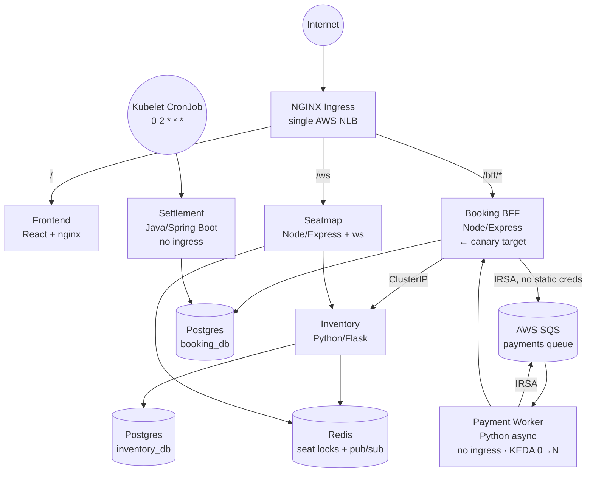

# Seat Booking Platform

A workload-agnostic delivery platform on AWS EKS. Six polyglot services
(Python/Flask, Node/Express, Java/Spring Boot) plus a React frontend, all
flowing through one golden path: **build → scan → SBOM → sign → GitOps sync
→ canary with SLO gating → automated rollback.**

> **The claim:** a synchronous request/response workload and an event-driven
> async workload go through the identical pipeline, with no platform changes
> between them.

**Demo video:** _(link here once recorded)_

---

## Architecture



Two services have **no ingress at all** — Payment Worker is queue-driven,
Settlement is schedule-driven. That asymmetry is deliberate: it's what makes
the "one golden path for two different workload shapes" claim concrete
rather than aspirational.

---

## What's actually running right now

These are live only while the AWS demo environment is up — check
[`docs/COMPLETE-REFERENCE.md`](docs/COMPLETE-REFERENCE.md) §17 for how to
get fresh links after any redeploy, since Load Balancer hostnames and
Grafana/Argo CD passwords change every time.

| | |
|---|---|
| The app | ephemeral AWS NLB — see reference doc |
| Argo CD | ephemeral AWS NLB — see reference doc |
| Grafana | ephemeral AWS NLB — see reference doc |
| CI pipeline | [GitHub Actions](../../actions) |

---

## Run it yourself, locally (free, no AWS needed)

```bash
docker compose up -d --build
```

This runs all 6 services + Postgres + Redis + ElasticMQ (a local SQS
emulator). Then:

```bash
curl -s -X POST http://localhost:8082/auth/login \
  -H 'content-type: application/json' -d '{"username":"demo","password":"demopass123"}'
# use the returned token:
curl -s -X POST http://localhost:8082/book \
  -H "authorization: Bearer <token>" \
  -H 'content-type: application/json' -d '{"showId":"s1","seats":["A1","A2"]}'
```

Or open http://localhost:8090 for the actual UI.

---

## The demos

| What | How |
|---|---|
| **Canary auto-rollback** | Add a 15% induced error rate to `booking-bff`'s tracked values, commit, push — Argo Rollouts steps to 10% traffic, PromQL analysis catches the breach, aborts automatically. Zero impact to stable traffic. Exact mechanism: [`COMPLETE-REFERENCE.md` §11](docs/COMPLETE-REFERENCE.md#11-the-canary-rollback-mechanism-precisely) |
| **Policy enforcement at admission** | `kubectl run bad-pod --image=nginx:latest` — Kyverno rejects it before it ever runs (root, `:latest` tag, missing probes) |
| **KEDA scale-to-zero** | Payment Worker sits at 0 replicas until real SQS messages arrive, then scales up and drains back to 0 |
| **GitOps self-heal** | `kubectl scale deploy/inventory --replicas=0` — Argo CD restores it within seconds, no one runs `kubectl apply` |
| **Signed supply chain** | Every image is Trivy-scanned (blocks on CRITICAL), SBOM'd, and Cosign-signed keylessly via GitHub OIDC — verify any image with `cosign verify` |

Full recording script with exact commands: [`docs/demo-script.md`](docs/demo-script.md)

---

## AWS deployment

```bash
export AWS_PROFILE=terraform-admin
cd platform/terraform/bootstrap && terraform init && terraform apply -auto-approve
cd ../envs/prod && terraform init && terraform apply
```

Provisions: VPC (single NAT Gateway, cost-conscious), EKS, 6 ECR repos, an
SQS queue, and 3 IRSA roles (real IAM per-service-account credentials — no
static AWS keys anywhere in this app).

**Set an AWS budget alert before the first apply — this project's is $20/mo
with alerts at 50%/90%.**

Full step-by-step: [`docs/aws-runbook.md`](docs/aws-runbook.md)
Teardown (ordered, avoids orphaned ELBs/ENIs): `./platform/terraform/teardown.sh`

---

## Design decisions

**Why six services and not a monolith.** For this domain a modular monolith
is the correct engineering choice — it ships faster and costs less to
operate. Services were split so platform features had something real to
exercise: cross-service tracing, per-service SLOs, NetworkPolicy isolation,
and cascading failure all need more than one deployable unit. In production
I would start with a monolith and extract only when a team or scaling
boundary demanded it.

**Per-service data ownership on one shared Postgres instance.** Inventory
owns `users`/`shows`; Booking BFF owns `bookings` — separate databases, same
RDS-cost-free in-cluster instance. Neither service ever queries the other's
tables directly; all cross-service communication is HTTP or the queue.

**Why no API gateway service.** Routing and TLS belong at the ingress layer,
rate limiting is a policy concern, and JWT validation belongs in each
service independently. A gateway would be an extra hop and a single point
of failure duplicating what NGINX Ingress already does.

**Why no service mesh.** Istio or Linkerd for six services is a week of
setup and a large operational surface, and sidecar injection conflicts with
Argo Rollouts' own traffic management at this scale. Evaluated and rejected.

**Why Kyverno over OPA Gatekeeper.** Policies are plain YAML, not Rego.
Kyverno also has first-class Cosign verification support built in, which is
the intended next step for this platform (`verifyImages` at admission —
deferred, see below).

**Why three languages.** To prove the golden path is not runtime-coupled.
Three base images, three dependency ecosystems (pip/npm/maven), three CVE
surfaces, one identical pipeline for all of them.

**Why a single NAT Gateway.** Cost. Three would be correct for production
HA; one is correct for a portfolio project running for a few hours at a
time. Documented as a trade-off rather than done silently.

**Readiness probes check only their own dependencies.** A BFF that probes
Inventory in `/readyz` takes every BFF pod out of rotation the moment
Inventory blips — a health check causing a total outage instead of a
partial one. Downstream failures get a timeout and an honest 504 instead.

**In-cluster Postgres/Redis instead of RDS/ElastiCache.** A deliberate cost
and setup-time trade-off for a demo environment that runs for hours, not
months — the honest answer if asked "why not managed data stores" is cost
and speed, not a technical limitation.

---

## Known limitations (stated, not hidden)

- **NetworkPolicy is declared but not fully enforced on this EKS cluster's
  default CNI configuration** — verified empirically, root-caused, and
  documented rather than silently claimed as working.
  [`COMPLETE-REFERENCE.md` §14, item 10](docs/COMPLETE-REFERENCE.md#14-every-real-bug-found-and-fixed-in-the-order-encountered)
- **CI rebuilds all 6 services on any code change** — no per-service
  selective build filtering yet (a `dorny/paths-filter`-based fix is the
  natural next step).
- Kyverno `verifyImages` (signature enforcement *at admission*, not just
  manual `cosign verify`) is deferred — the keyless-attestor + OIDC
  subject-matching setup is real work, budgeted separately.

## Out of scope (deliberately)

Social login, email verification, password reset, MFA, real payment
processing and PCI compliance, refunds, an admin UI, GDPR data flows.

---

## Every real bug found while building this

Not staged, not synthetic — the actual incidents hit while deploying this
to real AWS infrastructure, with root cause and fix for each:
[`docs/COMPLETE-REFERENCE.md` §14](docs/COMPLETE-REFERENCE.md#14-every-real-bug-found-and-fixed-in-the-order-encountered).
18 entries, from a `pip install --target` gotcha that silently dropped a
console script, to a GitHub OIDC subject-claim format change that broke
every CI run with a misleading error message, to three separate real
CRITICAL CVEs that Trivy actually caught and blocked.

---

## Repo layout

```
services/
  inventory/        Python / Flask — users, shows, seat locks
  booking-bff/       Node / Express — bookings, canary target
  seatmap/           Node / Express + ws — live seat updates
  payment-worker/    Python async — SQS consumer, KEDA-scaled
  settlement/        Java / Spring Boot — nightly CronJob
frontend/            React + Vite, served via nginx
platform/
  terraform/         bootstrap (state backend) + envs/prod (VPC/EKS/ECR/SQS/IRSA)
  charts/            ONE generic Helm chart, values-<service>[-aws].yaml per workload
  apps/               Argo CD app-of-apps
  policies/           Kyverno ClusterPolicy
  networkpolicies/    default-deny + explicit allows
  manifests/          Postgres/Redis/ElasticMQ (local infra substitutes)
  kind/               local cluster config
.github/workflows/    CI: gitleaks, Trivy, Syft, Cosign, GitOps promotion
docs/
  COMPLETE-REFERENCE.md   every AWS/K8s resource, every bug, A to Z
  aws-runbook.md          exact commands, deploy to teardown
  demo-script.md          recording script with exact on-camera commands
```
